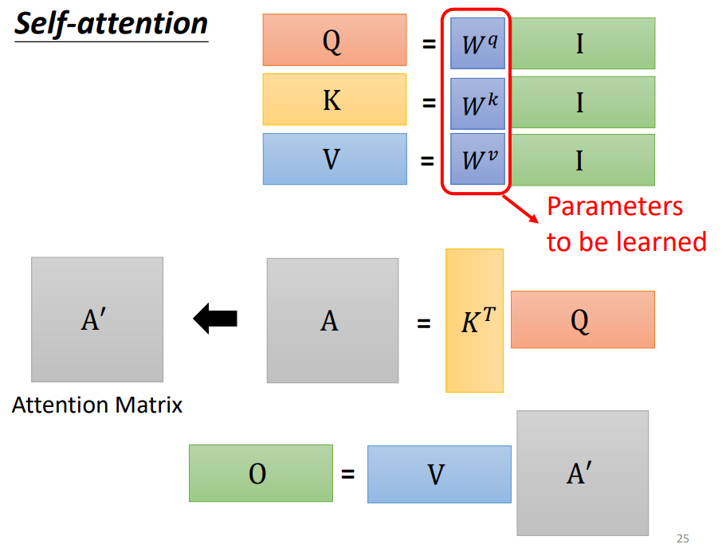
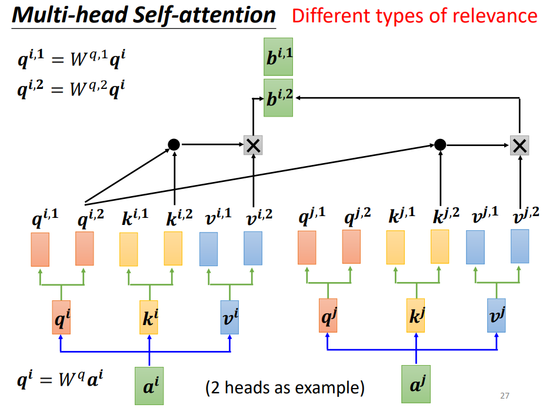
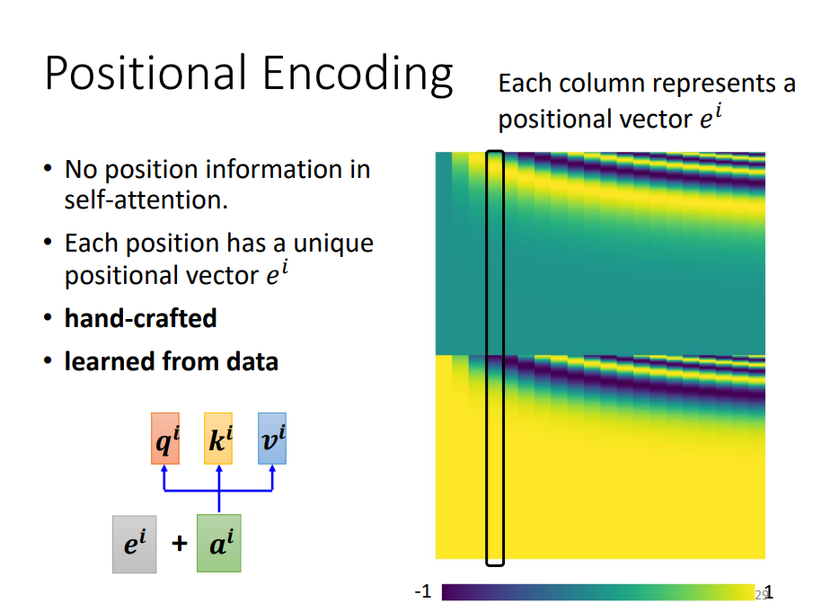

# ML2023-Lee

Some codes of machine learning from HUNG-YI LEE.

Class homepage : https://speech.ee.ntu.edu.tw/~hylee/ml/2023-spring.php

## ChatGPT 原理剖析

- **ChatGPT is not connected to the internet**. 多数 ChatGPT 的答案在网络上都找不到一模一样的句子，甚至有些是**假的**

- ChatGPT 的原理类似**文字接龙**

- 在多种语言上**预训练**后，只要教某个语言的某个任务，会自动学会其他语言的**同样任务**

- 对 ChatGPT 提出需求**Prompting**

## 机器学习基本概念

机器学习 = 机器自动找函数

找出函数的三步骤

- 选出候选函数额集合（Model: CNN, Transformer, Decision Tree, etc.）
- 设定评价函数好坏的标准（Loss: Supervised learning, Semi-supervised learning, RL, etc.）
- 找到最好的函数 $f^* = arg min_{f \in H} L(f)$

## 卷积神经网络

### Observation 1: Some patterns are much smaller than the whole image.

**常见参数**

- Kernel size
- Stride
- Padding

### Observation 2: The same patterns appear in different regions.

**共享参数**

### Observation 3: SubSampling the pixels will not change the object

- Convolution 和 Pooling 交替使用

* Pooling 可能影响精度，很多模型已减少 Pooling 使用

* Data augmentation 很重要

**Torchvision** 提供了很多数据处理的函数，如：

```
test_tfm = transforms.Compose([
    transforms.Resize((128, 128)),
    transforms.ToTensor(),
])

# However, it is also possible to use augmentation in the testing phase.
# You may use train_tfm to produce a variety of images and then test using ensemble methods
train_tfm = transforms.Compose([
    # Resize the image into a fixed shape (height = width = 128)
    transforms.Resize((128, 128)),
    # You may add some transforms here.

    # ToTensor() should be the last one of the transforms.
    transforms.ToTensor(),
])
```

## 自注意力机制







## Batch Normalization

## Transformer

* Sequence-to-sequence model: 输出长度由model决定
* Encoder + Decoder


## Generative Adversarial Network
* 模型的输入不仅有x, 还有simple distribution
* 为什么GAN很难Train：Generator和Discriminator互相影响，一个变差会使另一个也变差；如果有个epoch的loss没有下降，可能会导致后续越训练越差
* 增强输入和输出之间的联系：cycleGAN - train两个generator
